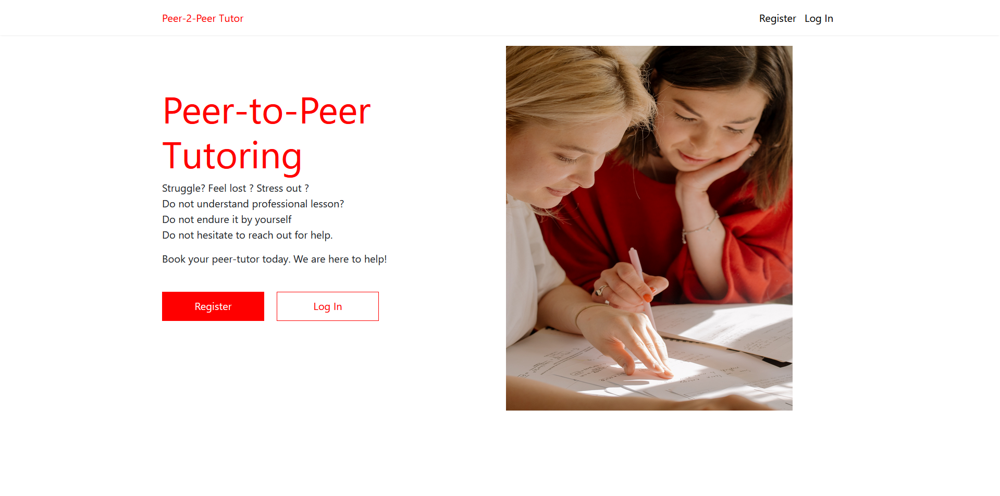
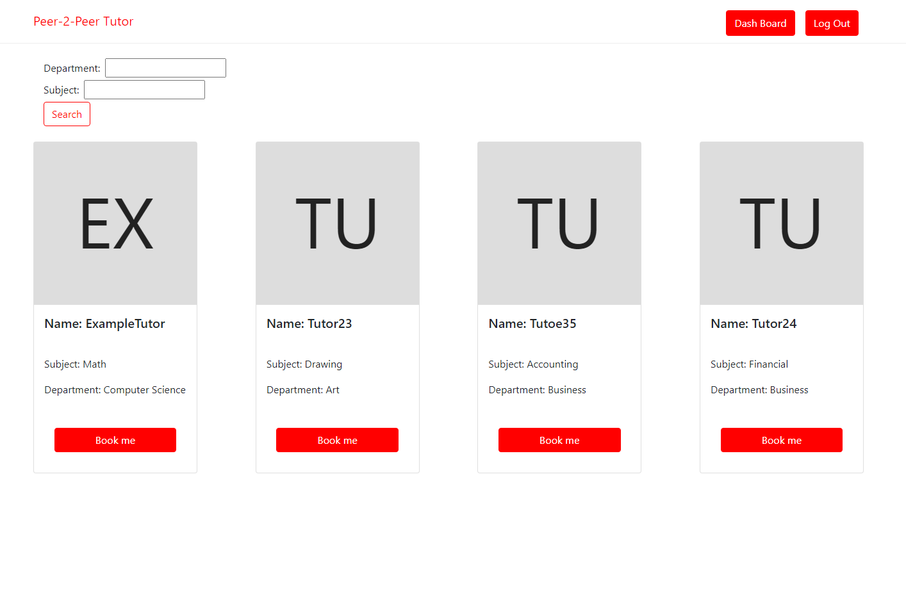
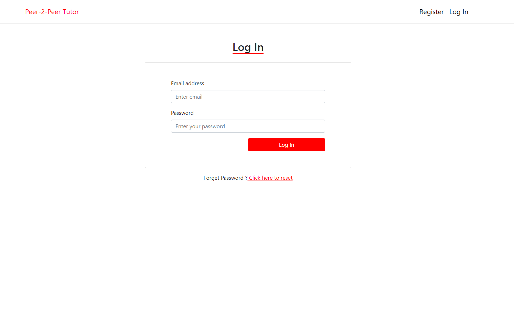
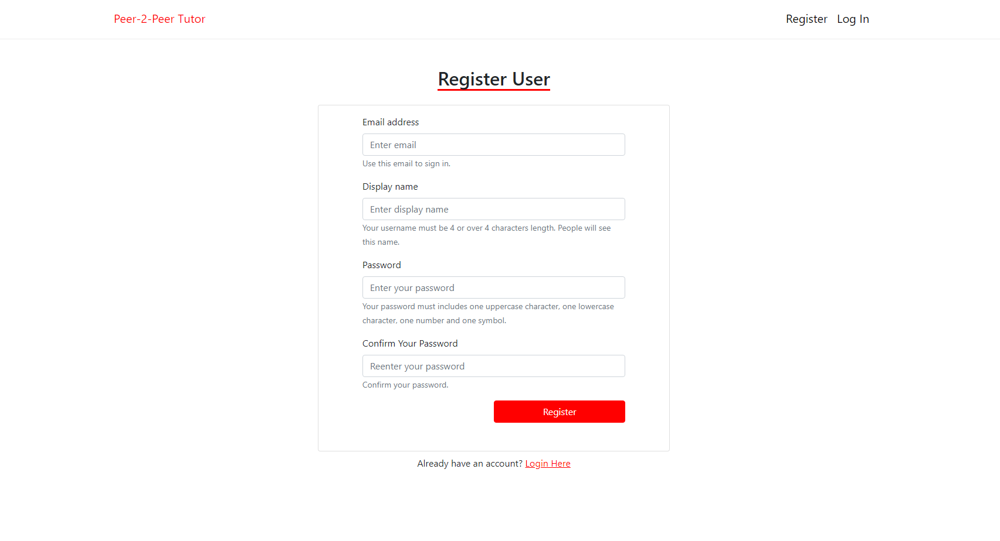
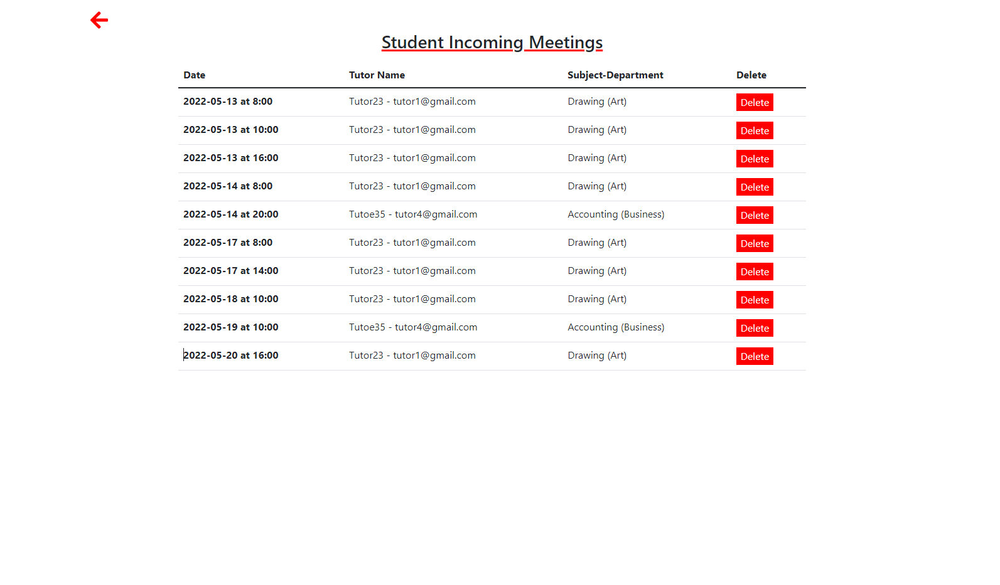
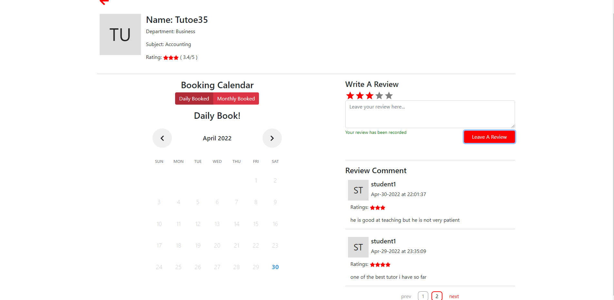
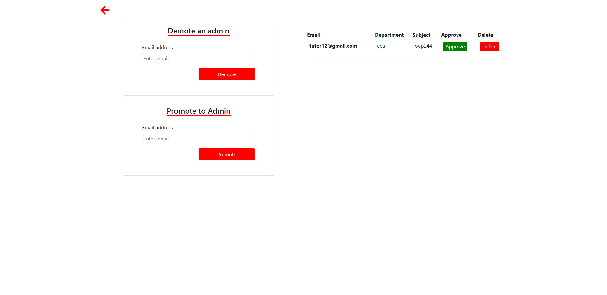
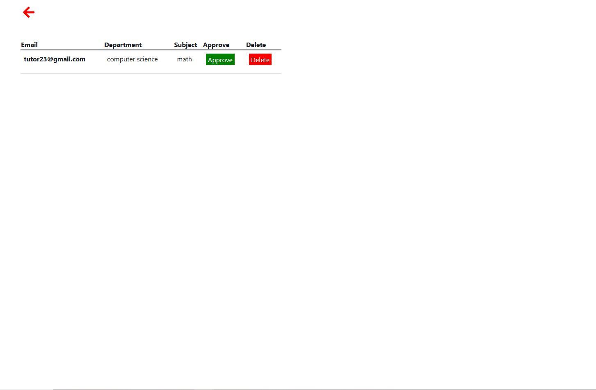

# PeerTutor - Book your tutor now

# Live Web:

    https://peer-tutor-vivy.herokuapp.com

# How To Start:

    1. Clone this project
    2. Run 'npm install'
    3. Run 'cd client'
    4. Run 'npm install --force'
    5. Run 'cd ..'
    6. Run 'npm run dev'
    7. The website will run on your http://localhost:3000/

# Languages:

    1. Front-end: ReactJS
    2. Back-end: NodeJS, ExpressJS
    3. State Changing: Redux && ReduxToolKit
    4. Database: PostGreSQL
    5. Style: Bootstrap && React-Bootstrap
    6. Main Language: Javascript

# Usage:

    1. Book , delete and finish an appointment
    2. Register, login and forget password user
    3. Has functionality in promote, demote an admin
    4. Request to be a tutor
    5. Find tutor based on their department and subject

# Role:

## Student

    1. Book daily , monthly appointment
    2. Track, delete a booked appointment
    3. Be a tutor

## Tutor

    1. Book other tutor if needed
    2. Delete, update a booked appointment

## Admin

    1. Approve tutor request

## Super Admin

    1. Promote, demote admin

# Showcase:

## Landing Page

## Home Tutor Page

## Login && Register

## Student Incoming Booking

## Tutor Page

## Dashboard Page (For super admin)

## Dashboard Page (For admin)

